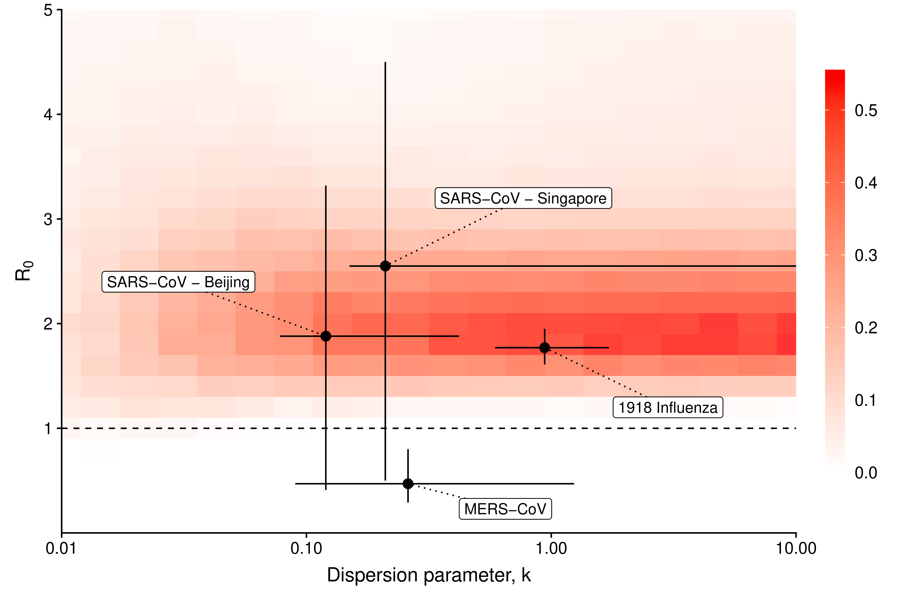

# Pattern of early human-to-human transmission of Wuhan 2019-nCoV

Julien Riou, MD PhD (julien.riou@ispm.unibe.ch) and Christian L. Althaus, PhD (christian.althaus@alumni.ethz.ch)

*Institute of Social and Preventive Medicine, University of Bern, Switzerland*

**Abstract.** Since December 2019, China has been experiencing a large outbreak of a novel coronavirus (2019-nCoV) which can cause respiratory disease and severe pneumonia. We estimated the basic reproduction number R0  of 2019-nCoV to be around 2.2 (90\% high density interval: 1.4–3.8), indicating the potential for sustained human-to-human transmission. Transmission characteristics appear to be of similar magnitude to severe acute respiratory syndrome-related coronavirus (SARS-CoV) and pandemic influenza, indicating a risk of global spread.

**Figure.** Proportion of simulated epidemics that lead to a cumulative incidence
 between 1,000 and 9,700 on January 18, 2020. This can be interpreted
 as the combinations of R0 and k values most compatible with 
epidemic data available on 2019-nCoV as of January 23, 2020. 
As a comparison, we show the estimates of R0 and k for the 
early human-to-human transmission of SARS-CoV in Singapore and 
Beijing, and of 1918 pandemic influenza (Lloyd-Smith et al., 2005; 
Fraser et al., 2011; Kucharski et al., 2015).

